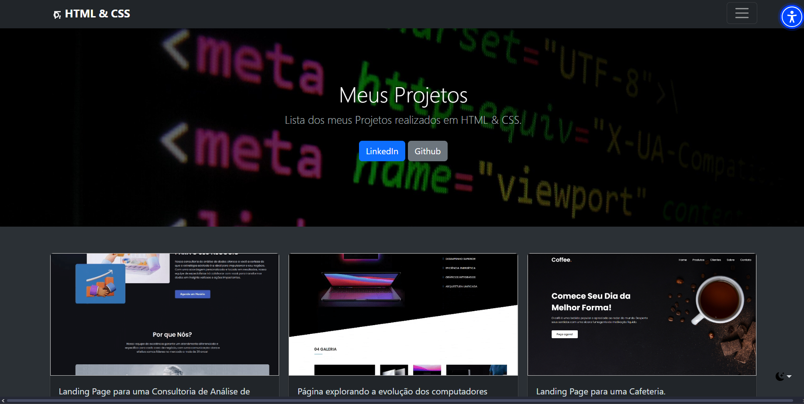

# Projetos de HTML & CSS

 
 
 - Conjunto de todos os meus projetos de HTML & CSS

 - Projeto construído durante o curso PROPROFISSÃO.

 - Para tornar a navegação mais acessível o site conta com uma API de Acessibilidade e de Tradução para mais de 120 Línguas.

## Acesso 👨🏻‍💻
 [Clique aqui para acessar! :)](https://projetoshtml-fellype.vercel.app)

## Tecnologias 👾
- HTML
- CSS
- Bootstrap
- API
- Git e Github

## Contato
[(LinkedIn)](https://www.linkedin.com/in/fellype-oliveira-920699230/)
-----
fellypeoliveira2020@gmail.com